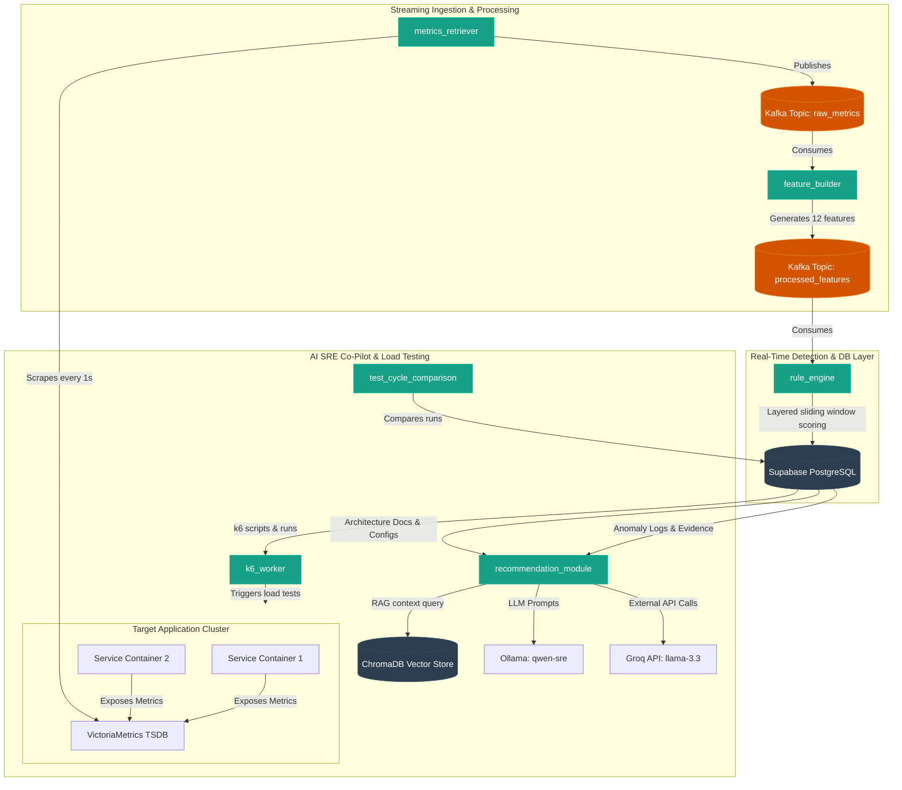

# 🛡️ Chamora Platform: Real-Time Anomaly Detection & AI-SRE Co-Pilot (Backend)

[](https://python.org)
[](https://fastapi.tiangolo.com)
[](https://kafka.apache.org)
[](https://supabase.com)
[](https://ollama.com)
[](https://docker.com)

**Chamora** is an enterprise-grade, multi-tenant, real-time anomaly detection and automated reliability testing orchestration platform designed for modern containerized architectures. By combining streaming metrics pipeline execution via **Apache Kafka**, customized statistical rule engines, local machine learning inference, and LLM-powered **RAG SRE chatbots**, Chamora automates root-cause analysis (RCA) and performance regression tracking.

---

## 🗺️ Architectural Flow

The Chamora backend runs a distributed microservice architecture. Telemetry flows asynchronously through Kafka, triggers real-time rule engine alerts, logs events to Supabase Postgres, and feeds the LLM recommendation agent.



---

## 🏗️ Repo Layout & Structure

The repository is structured as a `uv` multi-package workspace:

```
Chamora/
├── main.py                     # Root FastAPI backend entrypoint (mounts routes, starts lifespan)
├── Dockerfile                  # Dockerfile for backend FastAPI app
├── docker-compose.yml          # Container configuration orchestrating the 8 core services
├── pyproject.toml              # UV workspace project metadata and global python dependencies
├── uv.lock                     # Lockfile for precise reproducible environment installations
├── AGENTS.md                   # Detailed onboarding and gotchas guidance for AI coding agents
├── api/
│   └── v1/
│       ├── api_router.py       # Registry mounting all REST controllers under /api/v1
│       └── rca_router.py       # API endpoints forwarding anomaly details for RCA execution
├── db/
│   ├── base.py                 # SQLAlchemy declarative base setup
│   ├── connection.py           # Database connection, pooling, and PgBouncer configuration
│   ├── init_db.py              # Auto-verifies schemas and database initialization helpers
│   └── models.py               # Database schemas (Users, Apps, Endpoints, Runs, Configs, Anomalies)
├── services/                   # Modular service architecture layer (Router -> Service -> Schema)
│   ├── anomalyFlagService/     # Manages viewing and updating logged anomalies
│   ├── anomaly_config_registration/ # Handles custom threshold tuning per endpoint
│   ├── app_registration/       # Registration of application metadata and VictoriaMetrics endpoints
│   ├── auth/                   # JWT Auth endpoints, registration, login and profile management
│   ├── document_registration/  # Vector storage registration for target system architecture docs
│   ├── load_testing_services/  # API endpoints to register, execute, and monitor k6 script cycles
│   ├── test_cycles/            # Tracks load-testing runs and statuses
│   └── test_script_registration/ # Saves and retrieves k6 script files from Supabase bucket
└── packages/                   # Dedicated internal packages running in standalone containers
    ├── metrics_retriever/      # Scrapes app metrics, publishes to Kafka raw_metrics topic
    ├── feature_builder/        # Consumes raw metrics, structures 12 aggregated feature vectors
    ├── rule_engine/            # Sliding window scoring algorithm judging metrics against configurations
    ├── recommendation_module/  # Chatbot & recommendation API (RAG pipelines via ChromaDB)
    ├── test_cycle_comparison/  # Metric comparators comparing baseline metrics vs load test cycles
    ├── rca_engine/             # Model servers, prompt templates, and local Ollama integrations
    └── k6_worker/              # Worker parsing load test orders, running k6 scripts, saving metrics
```

---

## ⚡ Technical Deep-Dive

### 1. Ingestion & Feature Engineering (`feature_builder`)
The `feature_builder` processes raw inputs into an aggregated feature payload containing exactly **12 metrics features**:

1. **`latency_p95`**: 95th percentile request latency.
2. **`latency_std`**: Standard deviation of response latency.
3. **`error_rate`**: Non-2xx response status ratio.
4. **`cpu_usage_rate`**: Current container CPU core usage.
5. **`memory_usage`**: Container memory utilization (average).
6. **`net_throughput`**: Combined network TX/RX bandwidth.
7. **`disk_io_rate`**: Disk IO throughput.
8. **`memory_growth_rate`**: Delta increase rate of memory over time (`(m_t - m_prev) / dt`).
9. **`restart_flag`**: A binary flag (`1` or `0`) indicating whether the container restarted.
10. **`memory_pressure`**: Memory consumption ratio compared to total host capacity.
11. **`cpu_container_vs_node_ratio`**: Container CPU consumption ratio compared to host capacity.
12. **`failure_streak`**: Counter track of sequential failed HTTP/TCP health probes.

### 2. Multi-Layer Anomaly Detection (`rule_engine`)
The `rule_engine` maintains a **3-point sliding window** (`T1`, `T2`, `T3`) for each configured endpoint. It averages features across the window to compute a multi-layered score:

*   **Layer A: Endpoint Health (50% Weight)**: Triggered by latency, error rate, failure streaks, and latency standard deviation exceeding limits.
*   **Layer B: Container Health (30% Weight)**: Triggered by high CPU consumption, container restarts, or memory growth rate exceeding 5% over the window.
*   **Layer C: Host Health (20% Weight)**: Triggered by memory pressure, disk I/O bottlenecks, or CPU capacity depletion at the host node.

#### Specialized Correlation Rules
The engine correlates metrics to isolate specific failure modes, boosting the anomaly score (up to a max of `1.0`) and assigning specific tags:
*   **`CPU_INDUCED_LATENCY`** (+0.4): High CPU utilization coinciding with latency threshold violations.
*   **`IO_WAIT_CONTENTION`** (+0.3): High disk IO with elevated latency standard deviations.
*   **`MEMORY_EXHAUSTION_OR_LEAK`** (+0.4): Extreme memory pressure matching positive growth rate.
*   **`CRASH_LOOP_DETECTED`** (+0.5): High error rates matched with a container restart flag.
*   **`RESOURCE_THRASHING`** (+0.4): Combined high CPU and high memory pressure.
*   **`PERSISTENT_FAILURE_WITH_DEGRADATION`** (+0.3): Long failure streaks combined with elevated response latency.

#### Anomaly Classification
*   **Score < 0.6**: Evaluated as Normal (ignored).
*   **0.6 <= Score < 0.7**: Flagged as **WARNING** anomaly.
*   **Score >= 0.7**: Flagged as **CRITICAL** anomaly.

### 3. AI Root Cause Analysis & RAG Chatbot
*   **RCA Inference**: Integrates a local model (`qwen-sre:latest`) hosted on Ollama or remote APIs (Groq `llama-3.3-70b-versatile`). It extracts logged anomaly windows, collects evidence tables, and runs a diagnostic prompt to trace the source of failures.
*   **SRE chatbot (RAG)**: Ingests architectural documents and system diagrams. It converts them to vector embeddings using `fastembed` and indexes them in `chromadb`. When queries arrive, the pipeline performs vector lookup to provide context-aware, repository-specific debug suggestions.

---

## 🛠️ Running Backend Services Locally

### Prerequisites
1.  **Docker & Docker Desktop** (with Compose v2).
2.  **Ollama** installed on the host machine.
3.  **Python 3.12** and **uv** package manager (for local script execution outside container).

### Step 1: LLM Model Setup (Ollama)
The SRE recommendation system utilizes a fine-tuned version of Qwen (`qwen-sre`).
1.  Install Ollama: `https://ollama.com`
2.  Download the `qwen-sre.gguf` file (approx. 3.1GB, hosted on Hugging Face).
3.  Import the model using the provided Modelfile:
    ```bash
    ollama create qwen-sre -f Modelfile
    ```
4.  Verify registration:
    ```bash
    ollama list
    ```

### Step 2: Environment Setup
1.  Copy the example env file in the root directory:
    ```bash
    cp .env.example .env
    ```
2.  Configure crucial variables inside `.env`:
    *   `DATABASE_URL`: Connection URL of your Supabase Postgres database. Note: A pooler connection is required, `prepared_statement_cache_size=0` is automatically appended to bypass PgBouncer issues.
    *   `OLLAMA_API_URL`: Use `http://host.docker.internal:11434` to route traffic from dockerized backend to Ollama running on the host machine.
    *   `SUPABASE_URL`, `SUPABASE_KEY`: Storage parameters to save uploaded k6 and architecture scripts.
    *   `GROQ_API_KEY`: API Key for external AI models fallback.

### Step 3: Spin Up Containers
Launch the microservice stack:
```bash
docker compose up -d --build
```

Monitor service health:
```bash
docker compose ps
```

To follow logs for a specific service:
```bash
docker compose logs -f rule_engine
```

To perform a clean reset (wiping Kafka persistent states):
```bash
docker compose down -v
```

---

## 🔗 Port Mapping Reference

Once the stack is running, services are mapped to the host as follows:

| Service | Port (Host:Container) | Description |
| :--- | :--- | :--- |
| **Backend API** | `8000:8000` | Core REST endpoints & Swagger docs (`/docs`) |
| **Recommendation module** | `8010:8000` | SRE Chatbot & recommendation services |
| **RCA Engine** | `8020:8000` | ML inference engine & Ollama connection hub |
| **Test Comparison** | `8030:8000` | Test cycle statistical analytics comparator |
| **Kafka UI** | `8085:8080` | Topic visualizer, partition inspector & broker state |
| **Kafka Broker** | `9092:9092` | Core Kafka transport (external access) |
