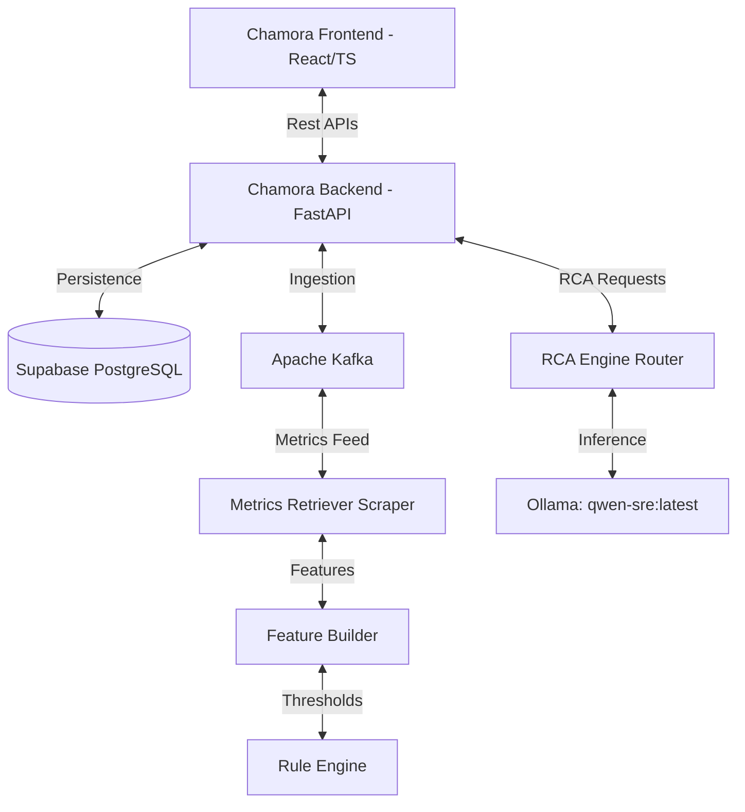

# 🛡️ Chamora Anomaly Analysis & SRE Diagnostic Platform

Welcome to **Chamora**, an end-to-end Automated Performance Monitoring and AI-driven Root Cause Analysis (RCA) platform. 

The platform leverages machine learning ingestion pipelines to detect real-time resource degradation and correlates telemetry footprints with a custom fine-tuned **Qwen-SRE LLM** to deliver detailed diagnostic root causes, confidence scores, and remediation recommendations.

---

## 🏗️ System Architecture



---

## 📂 Repository Components

If you are setting up the platform, make sure you have cloned the three core components:
1. **`Chamora-backend`**: The FastAPI REST API, database connection manager, Kafka consumers/producers, and Docker Compose orchestration stack.
2. **`Chamora-frontend`**: The React + TypeScript user interface built with Vite.
3. **`fineTuneLLM v2`**: The AI SRE model training folder containing training datasets, prompt models, and configuration files.

---

## 🚀 Step-by-Step Setup Guide

Follow this guide to get the complete platform up and running on your local machine.

### Phase 1: Download & Initialize the Fine-Tuned Model (Ollama)

Since the fine-tuned SRE model file (`qwen-sre.gguf`) is **3.1 GB**, it is hosted separately on Hugging Face instead of Git.

1. **Install Ollama**:
   * Download and install the Ollama runner from the official website: [ollama.com](https://ollama.com/).
   * Verify it is running in your terminal:
     ```bash
     ollama --version
     ```

2. **Download the GGUF Weights**:
   * Navigate to the Hugging Face Model Hub:
      https://huggingface.co/sndrudsun/fineTuned_RCA
   * Download the file `qwen-sre.gguf` (approx. 3.1 GB).
   * Place the downloaded `qwen-sre.gguf` file directly inside the cloned **`fineTuneLLM v2`** directory.

3. **Register the Model in Ollama**:
   * Open your terminal and navigate to the `fineTuneLLM v2` folder:
     ```bash
     cd fineTuneLLM\ v2
     ```
   * Build the model using the provided `Modelfile` recipe:
     ```bash
     ollama create qwen-sre -f Modelfile
     ```
   * Confirm the model is successfully loaded:
     ```bash
     ollama list
     ```
     *(You should see `qwen-sre:latest` listed in the output).*

---

### Phase 2: Start the Backend Services (Docker Compose)

The backend runs inside containerized services managed by Docker.

1. **Navigate to the Backend Directory**:
   ```bash
   cd ../Chamora-backend
   ```

2. **Configure Environment Variables**:
   * Copy the environment template:
     ```bash
     cp .env.example .env
     ```
   * Open the `.env` file and configure your credentials:
     ```env
     # Supabase Connection Link
     DATABASE_URL=postgresql+asyncpg://<username>:<password>@<host>:<port>/postgres
     
     # Ollama Host Bridge Configuration
     # host.docker.internal allows Docker containers to route requests back to Ollama running on your host machine.
     OLLAMA_API_URL=http://host.docker.internal:11434
     
     # Disable strict static thresholds overriding ML predictions
     GUARDRAILS_ENABLED=False
     ```

3. **Launch the Docker Stack**:
   * Start the Kafka brokers, scrapers, API endpoints, and processors:
     ```bash
     docker compose up -d --build
     ```
   * Verify all containers are active:
     ```bash
     docker compose ps
     ```

---

### Phase 3: Start the Frontend Application

1. **Navigate to the Frontend Directory**:
   ```bash
   cd ../Chamora-frontend
   ```

2. **Install Dependencies**:
   ```bash
   npm install
   ```

3. **Start the Development Server**:
   ```bash
   npm run dev
   ```
   * Open your browser and navigate to the local dashboard URL: **`http://localhost:5173`**

---

## 🎯 Verification: Testing the End-to-End Workflow

To verify the integration is working as expected:
1. Open the dashboard at `http://localhost:5173`.
2. Navigate to the **Anomaly Flags** page for your monitored application.
3. Locate an anomaly flagged as **"Identified by machine learning model"**.
4. Click on the **"Root Cause"** button next to the anomaly.
5. The frontend will trigger an API call to `/api/v1/analyze`. The backend will:
   * Correctly parse nested telemetry parameters from `raw_values`.
   * Pass them to your local `qwen-sre` model.
   * Return the SRE Root Cause (e.g. `GC_PRESSURE`), Confidence Score, Affected Component, reasoning summary, and actionable remediation steps to your browser screen!
